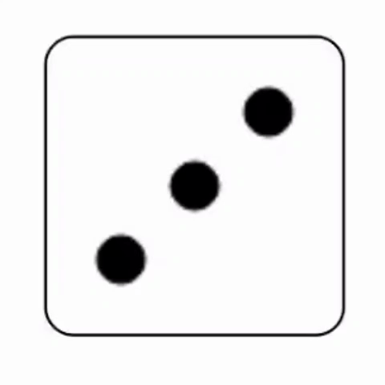

# DiceJS 
DiceJS is a free JavaScript plugin to simulate six-sided dice in webpages. Its only dependencies are JavaScript (ES6 and later) and HTML canvases.

Check the [Documentation](https://paramsiddharth.github.io/DiceJS/) out to learn more on how to use it.

Download [DiceJS](https://github.com/paramsiddharth/DiceJS/raw/master/source/dice.js) to use it in your webpage.
